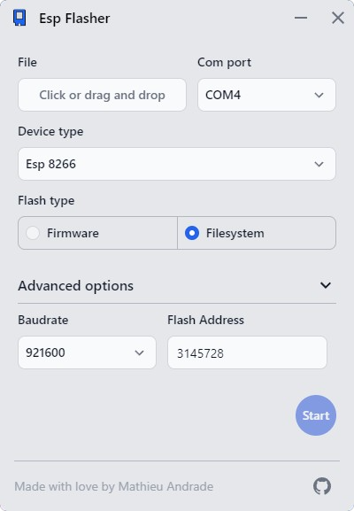

<a name="readme-top"></a>

<p align="center">
    <a href="https://github.com/MathieuAndrade/Esp-flasher/network/members" alt="Forks">
      
    </a>
    <a href="https://github.com/MathieuAndrade/Esp-flasher/stargazers" alt="Stargazers">
      
    </a>
    <a href="https://github.com/MathieuAndrade/Esp-flasher/contributors" alt="Contributors">
      
    </a>
</p>

<!-- PROJECT LOGO -->
<br />
<div align="center">
  <a href="https://github.com/othneildrew/Best-README-Template">
    
  </a>

  <h3 align="center">Esp Flasher</h3>

  <p align="center">
    An app for beginner user to flash firmware and image on esp devices without installing an ide and some complicated software.
    <br />
    <a href="https://github.com/MathieuAndrade/Esp-flasher/issues">Report Bug</a>
    ·
    <a href="https://github.com/MathieuAndrade/Esp-flasher/issues">Request Feature</a>
  </p>
</div>

<!-- TABLE OF CONTENTS -->
<details>
  <summary>Table of Contents</summary>
  <ol>
    <li>
      <a href="#about-the-project">About The Project</a>
    </li>
    <li>
      <a href="#getting-started">Getting Started</a>
      <ul>
        <li><a href="#prerequisites">Prerequisites</a></li>
        <li><a href="#installation">Installation</a></li>
      </ul>
    </li>
    <li><a href="#download">Download</a></li>
    <!--<li><a href="#usage">Usage</a></li>-->
    <li><a href="#roadmap">Roadmap</a></li>
    <li><a href="#contributing">Contributing</a></li>
    <li><a href="#license">License</a></li>
    <li><a href="#contact">Contact</a></li>
    <li><a href="#acknowledgments">Acknowledgments</a></li>
  </ol>
</details>
</br>

<!-- ABOUT THE PROJECT -->

## About The Project

</br>
<div align="center">
  
</div>
</br>

There are many methods to upload firmware to esp devices, but every developer has at least once encountered a frustrated user who tried to use their program and failed it. Why ? The response is very simple, because user has not installed all necessary libraries or he has installed bad version of libraries or he has not configured his IDE correctly. And for this user, the fault lies to the developer.

This case is all the more present when the project is destined to be distributed in an open source way.

So this is goals of this project to solve this problem:

- End user not need to install anything instead of this software
- End user only needs minimal and simple configuration
- Developers build a bin file (bin file that works) and send it to user
- End user upload his bin file and it works, nothing else

<p align="right">(<a href="#readme-top">back to top</a>)</p>

<!-- GETTING STARTED -->

## Getting Started

### Prerequisites

This app required [Rust](https://www.rust-lang.org/fr/tools/install) and [Yarn](https://classic.yarnpkg.com/lang/en/docs/install) installation. Keep in mind that this section is only needed for developing purpose.
**If you are simple user, you not required to do any of this, instead go to <a href="#download">download</a> section.**

### Installation

1. Clone the repo
   ```sh
   git clone https://github.com/MathieuAndrade/Esp-flasher.git esp-flasher
   ```
2. Go into the repository
   ```sh
   cd esp-flasher
   ```
3. Install NPM packages
   ```sh
   yarn install
   ```
4. Run the app
   ```sh
   yarn tauri dev
   ```

<p align="right">(<a href="#readme-top">back to top</a>)</p>

<!-- USAGE EXAMPLES -->

<!--
## Usage

Use this space to show useful examples of how a project can be used. Additional screenshots, code examples and demos work well in this space. You may also link to more resources.

_For more examples, please refer to the [Documentation](https://example.com)_

<p align="right">(<a href="#readme-top">back to top</a>)</p>
-->

<!-- DOWNLOAD -->

## Download

You can [download](https://github.com/MathieuAndrade/Esp-flasher/releases) the latest installable version of Esp-Flasher for Windows, macOS and Linux.

<!-- ROADMAP -->

## Roadmap

- [ ] Allow Arduino boards
- [ ] Allow developers to create a configuration file imported by users
- [ ] Multi-language Support
- [ ] Make a portable version for Windows platform ([check this issue](https://github.com/tauri-apps/tauri-action/issues/302))

See the [open issues](https://github.com/MathieuAndrade/Esp-flasher/issues) for a full list of proposed features (and known issues).

<p align="right">(<a href="#readme-top">back to top</a>)</p>

<!-- CONTRIBUTING -->

## Contributing

Contributions are what make the open source community such an amazing place to learn, inspire, and create. Any contributions you make are **greatly appreciated**.

If you have a suggestion that would make this better, please fork the repo and create a pull request. You can also simply open an issue with the tag "enhancement".
Don't forget to give the project a star! Thanks again!

1. Fork the Project
2. Create your Feature Branch (`git checkout -b feature/AmazingFeature`)
3. Commit your Changes (`git commit -m 'Add some AmazingFeature'`)
4. Push to the Branch (`git push origin feature/AmazingFeature`)
5. Open a Pull Request

<p align="right">(<a href="#readme-top">back to top</a>)</p>

<!-- LICENSE -->

## License

Distributed under the MIT License. See `LICENSE.txt` for more information.

<p align="right">(<a href="#readme-top">back to top</a>)</p>

<!-- CONTACT -->

## Contact

Mathieu Andrade - [@MathieuAndrade](https://twitter.com/MathieuAndrade) - mathieu.andrade@hotmail.fr

Project Link: [https://github.com/MathieuAndrade/Esp-flasher](https://github.com/MathieuAndrade/Esp-flasher)

<p align="right">(<a href="#readme-top">back to top</a>)</p>

<!-- ACKNOWLEDGMENTS -->

## Acknowledgments

- [Espflash](https://github.com/esp-rs/espflash)
- [Choose an Open Source License](https://choosealicense.com)
- [Best-README-Template](https://github.com/othneildrew/Best-README-Template)

<p align="right">(<a href="#readme-top">back to top</a>)</p>

<!-- MARKDOWN LINKS & IMAGES -->
<!-- https://www.markdownguide.org/basic-syntax/#reference-style-links -->

[Svelte.dev]: https://img.shields.io/badge/Svelte-4A4A55?style=for-the-badge&logo=svelte&logoColor=FF3E00
[Svelte-url]: https://svelte.dev/
[Tauri.dev]: https://img.shields.io/badge/Tauri-FFC131?style=for-the-badge&logo=Tauri&logoColor=white
[Tauri-url]: https://tauri.app/
